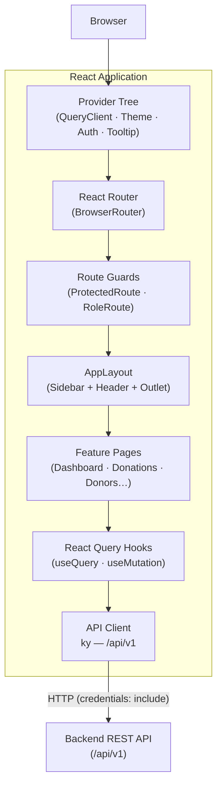
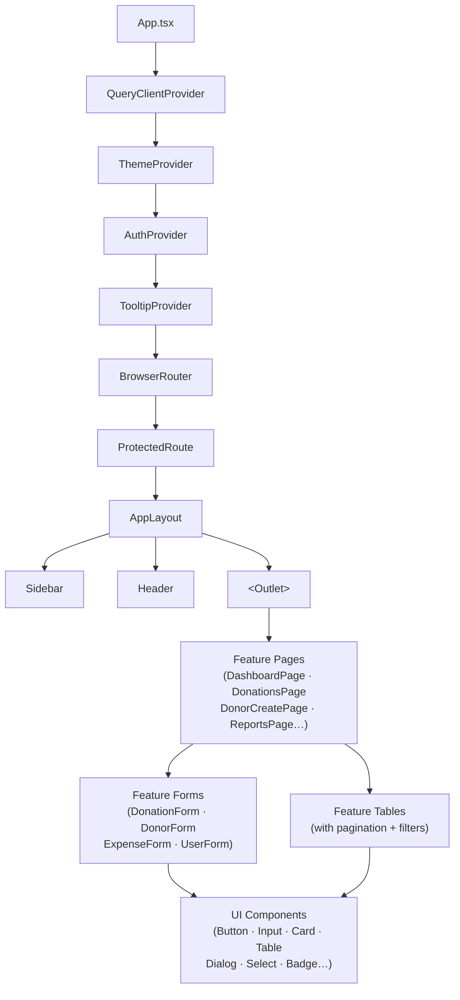
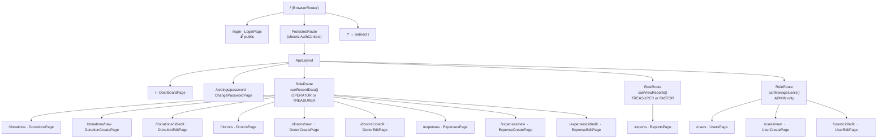
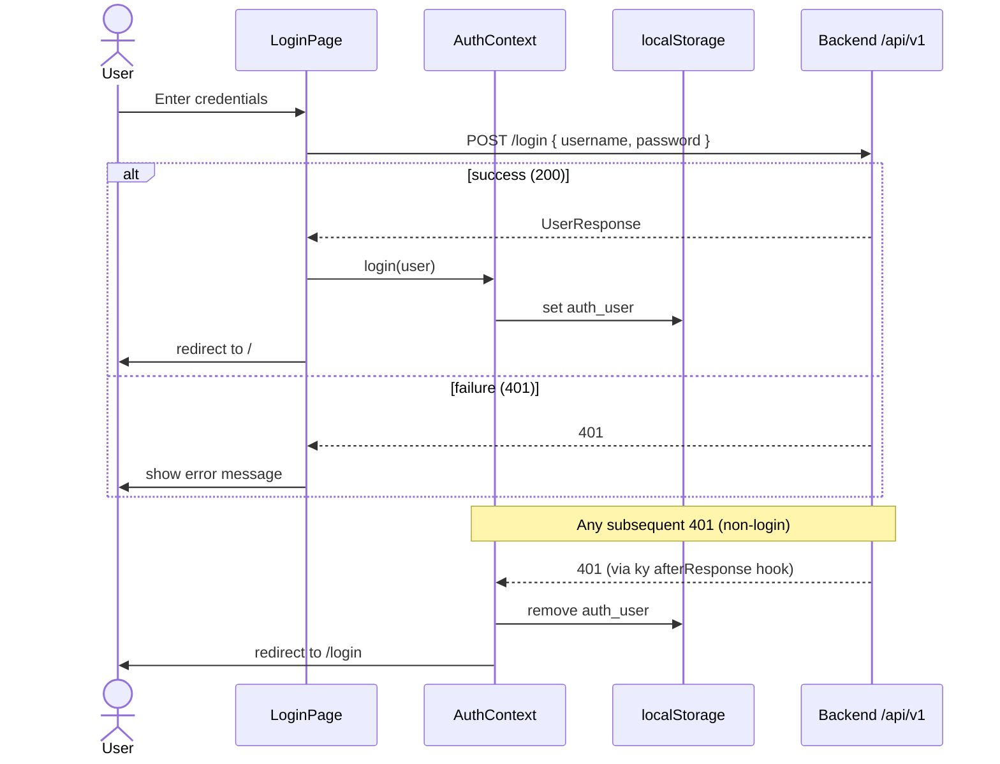
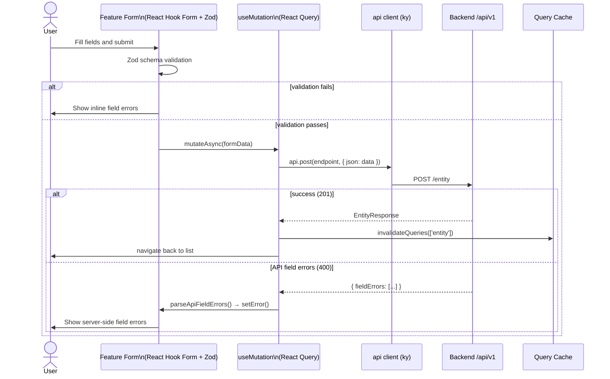
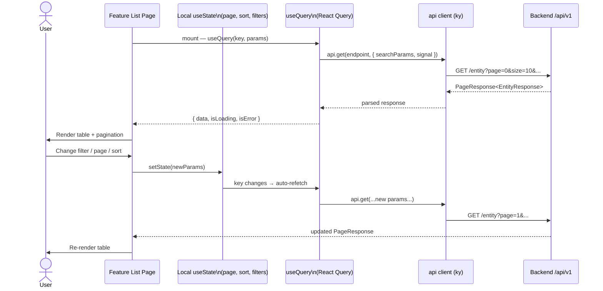
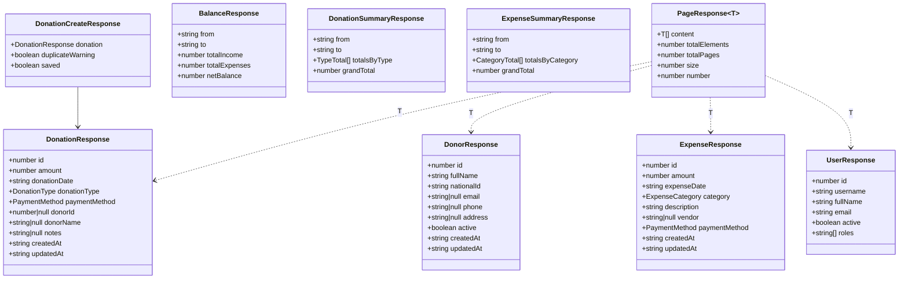
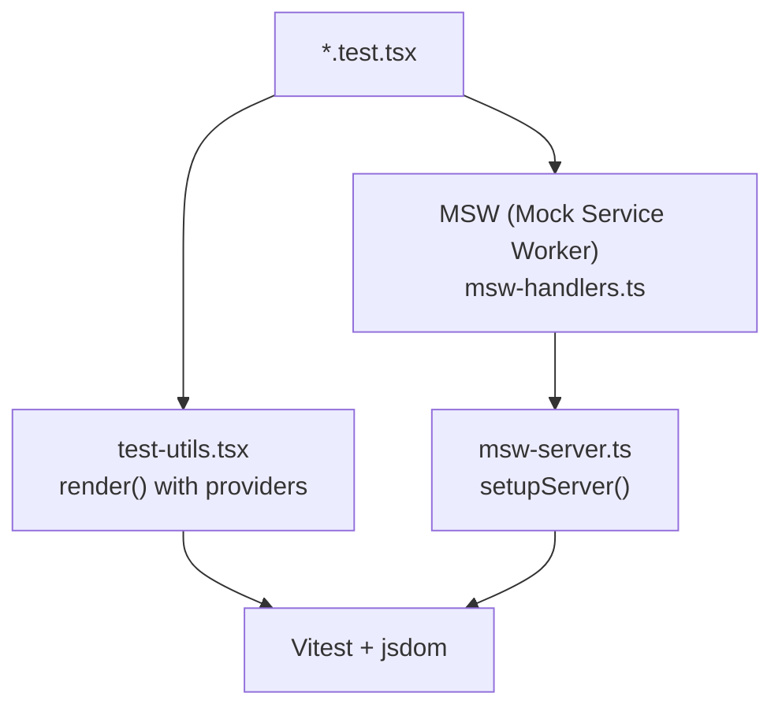

# Architecture — Donations Frontend

A React 19 SPA for managing church donations, expenses, and financial reports. Built with TypeScript, Vite, and a feature-driven module structure.

---

## Tech Stack

| Concern       | Library               | Version |
| ------------- | --------------------- | ------- |
| UI Library    | React                 | 19.2.5  |
| Language      | TypeScript            | 5.x     |
| Build Tool    | Vite                  | 8.0.9   |
| Routing       | React Router          | 7.14.1  |
| Server State  | TanStack React Query  | 5.99.2  |
| Forms         | React Hook Form       | 7.73.1  |
| Schema valid  | Zod                   | 4.3.6   |
| HTTP Client   | ky                    | 2.0.1   |
| Styling       | Tailwind CSS          | 4.2.2   |
| UI Primitives | Base UI               | 1.4.1   |
| Charts        | Recharts              | 3.8.0   |
| Icons         | Lucide React          | 1.8.0   |
| i18n          | react-i18next         | 17.0.4  |
| Dates         | Day.js                | 1.11.20 |
| Linting       | Biome                 | 2.4.12  |
| Testing       | Vitest                | 4.1.5   |
|               | React Testing Library | 16.3.2  |
| API Mocking   | MSW                   | 2.13.4  |

---

## Project Structure

```
src/
├── App.tsx                  # Root: provider tree + route declarations
├── main.tsx                 # Entry point
│
├── features/                # Feature modules (self-contained slices)
│   ├── auth/                # Login, protected routes, role guards, auth context
│   ├── dashboard/           # Home page with role-conditional stats
│   ├── donations/           # CRUD + duplicate detection
│   ├── donors/              # CRUD for donor master data
│   ├── expenses/            # CRUD for expense records
│   ├── reports/             # Financial summaries and charts
│   ├── settings/            # Change password
│   ├── theme/               # Dark/light mode context
│   └── users/               # Admin user management
│
├── layouts/
│   ├── app-layout.tsx       # Sidebar + Header + <Outlet>
│   ├── header.tsx           # Top navigation bar
│   └── sidebar.tsx          # Left nav with role-filtered links
│
├── components/
│   ├── ui/                  # Base UI components (Button, Input, Table, etc.)
│   ├── date-range-picker.tsx
│   ├── empty-state.tsx
│   └── skeleton.tsx
│
├── lib/
│   ├── api.ts               # ky HTTP client instance
│   ├── api-types.ts         # TypeScript interfaces for all API contracts
│   ├── permissions.ts       # Role-check functions (RBAC)
│   ├── formatters.ts        # Currency, date helpers
│   ├── parse-api-field-errors.ts  # Maps API validation errors to form fields
│   ├── i18n.ts              # i18next configuration (Spanish)
│   └── utils.ts             # cn() — Tailwind class merging
│
├── locales/
│   └── es.json              # Spanish translations
│
└── test/
    ├── setup.ts             # Vitest global setup
    ├── msw-server.ts        # MSW server instance
    ├── msw-handlers.ts      # API mock handlers
    └── test-utils.tsx       # render() wrapper with providers
```

---

## Application Layers



---

## Component Hierarchy



---

## Routing & Access Control



---

## State Management

Three independent state layers, each with a distinct scope:

| Layer             | Tool                           | Persistence      | Scope            |
| ----------------- | ------------------------------ | ---------------- | ---------------- |
| Server state      | TanStack React Query           | Memory (cache)   | All API data     |
| Auth / Theme / UI | React Context + `localStorage` | localStorage     | Session lifetime |
| Form state        | React Hook Form                | Component memory | Form lifetime    |

### Server State (React Query)

- Each feature exposes query/mutation hooks (e.g., `useDonations`, `useCreateDonation`).
- `QueryClient` is configured globally with `retry: false` and `refetchOnWindowFocus: false`.
- Mutations invalidate the parent collection query on success, keeping the list in sync.

### Auth & Theme (Context + localStorage)

- `AuthProvider` (`src/features/auth/auth-context.tsx`) stores the current user and exposes `login` / `logout`.
- `ThemeProvider` (`src/features/theme/theme-context.tsx`) persists dark/light preference under key `theme`.
- The sidebar collapse state is persisted under key `sidebar_collapsed`.

### Form State (React Hook Form)

- Each form defines a Zod schema in `*-schema.ts`.
- `useForm` is initialized with `zodResolver(schema)`.
- On submit: Zod validates locally, then the mutation fires. If the backend returns field-level errors, `parseApiFieldErrors()` maps them back to form fields.

---

## Authentication Flow



---

## Data Flow: Create Entity

Applies to donations, donors, expenses, and users.



---

## Data Flow: List with Filters & Pagination



---

## Feature Module Structure

Every feature follows the same file layout:

```
src/features/<name>/
├── <name>-schema.ts          # Zod validation schema + inferred form type
├── use-<name>.ts             # React Query hooks (useQuery + useMutation)
├── <name>s-page.tsx          # List page (table + filters + pagination)
├── <name>-create-page.tsx    # Create page (wraps form)
├── <name>-edit-page.tsx      # Edit page (loads entity, wraps form)
├── <name>-form.tsx           # Shared form component
└── *.test.tsx                # Vitest + RTL unit tests
```

Example — Donations:

| File                       | Responsibility                                                                            |
| -------------------------- | ----------------------------------------------------------------------------------------- |
| `donation-schema.ts`       | Zod schema for create/edit, inferred `CreateDonationFormData`                             |
| `use-donations.ts`         | `useDonations(params)`, `useDonation(id)`, `useCreateDonation()`, `useUpdateDonation(id)` |
| `donations-page.tsx`       | Paginated table with date-range filter and sort                                           |
| `donation-create-page.tsx` | Wraps form, handles duplicate-detection warning                                           |
| `donation-edit-page.tsx`   | Fetches existing donation, pre-fills form                                                 |
| `donation-form.tsx`        | Controlled form: amount, date, type, payment method, donor                                |

---

## API Client

**File:** `src/lib/api.ts`

```
ky instance
  prefix  →  window.location.origin + /api/v1
  credentials: 'include'   (session cookie forwarded on all requests)
  afterResponse hook:
    if status === 401 && url !== /login
      → localStorage.removeItem('auth_user')
      → window.location.href = '/login'
```

Usage pattern in hooks:

```ts
// Read
const data = await api
  .get('donations', { searchParams: { page: 0 }, signal })
  .json<PageResponse<DonationResponse>>();

// Write
const result = await api
  .post('donations', { json: payload })
  .json<DonationCreateResponse>();

// Update
await api.put(`donations/${id}`, { json: payload }).json<DonationResponse>();
```

---

## Type System

**File:** `src/lib/api-types.ts`



### Enums

| Type              | Values                                                                                |
| ----------------- | ------------------------------------------------------------------------------------- |
| `UserRole`        | `ADMIN` · `TREASURER` · `PASTOR` · `OPERATOR`                                         |
| `DonationType`    | `TITHE` · `OFFERING` · `SPECIAL_OFFERING` · `OTHER`                                   |
| `PaymentMethod`   | `CASH` · `BANK_TRANSFER`                                                              |
| `ExpenseCategory` | `RENT` · `UTILITIES` · `SALARIES` · `SUPPLIES` · `MISSIONS` · `MAINTENANCE` · `OTHER` |

---

## Testing Architecture



- Tests use `render()` from `test-utils.tsx`, which wraps components in the full provider tree (QueryClient, Auth, Theme).
- MSW intercepts `fetch` at the network layer, returning fixtures defined in `msw-handlers.ts`.
- The server resets handlers after each test to prevent state leakage.
- No component mocks — tests exercise real hooks against real MSW responses.

Run tests: `pnpm run test`
