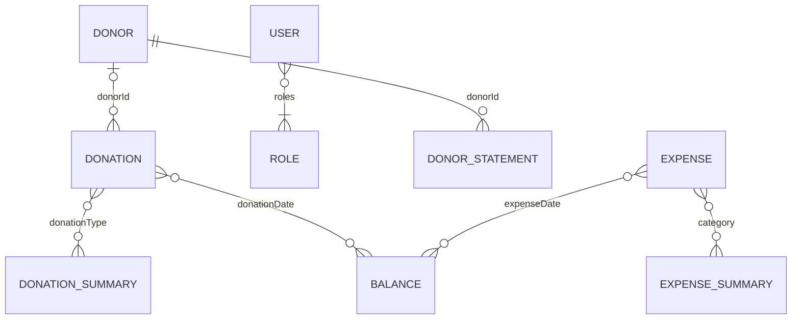
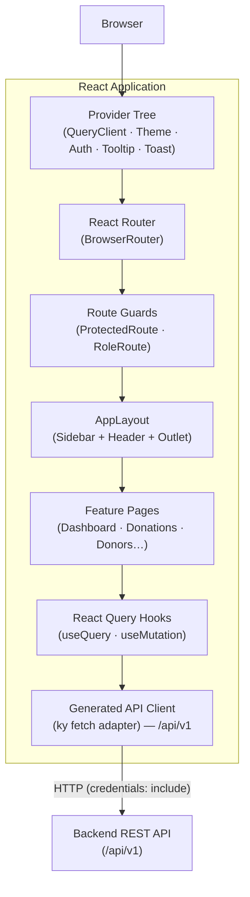
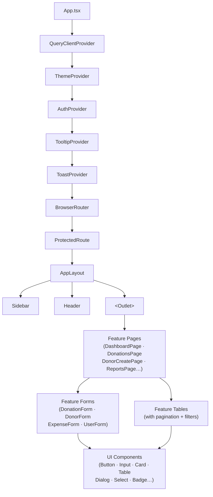
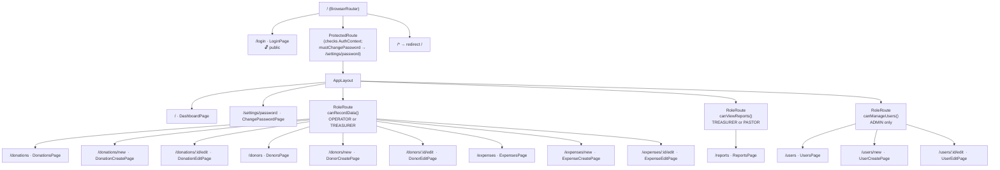
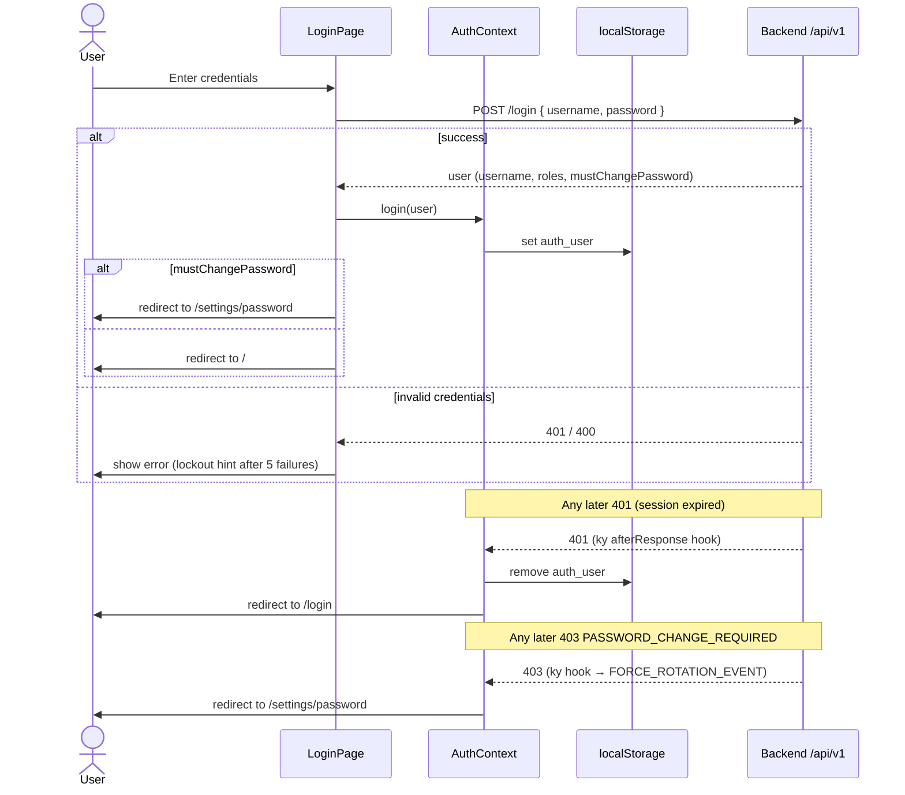
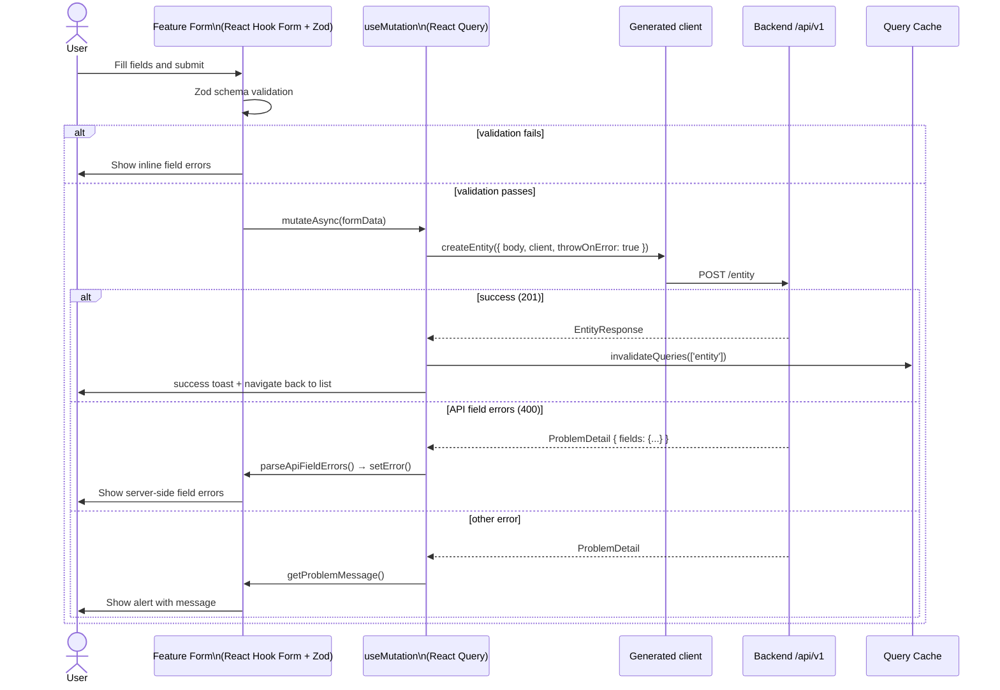
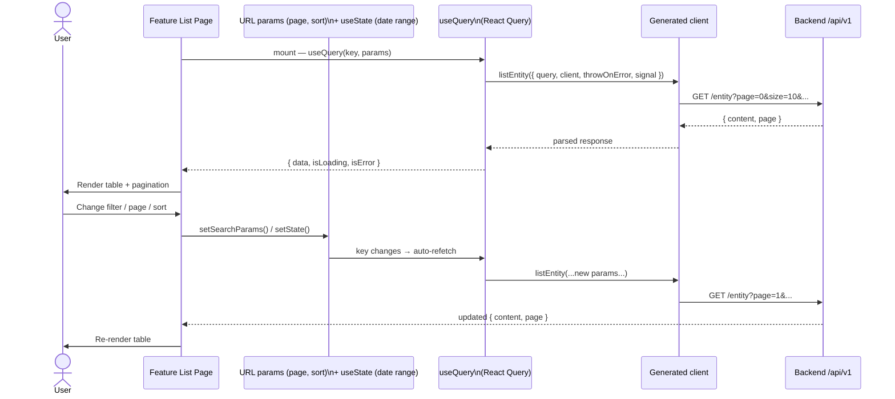
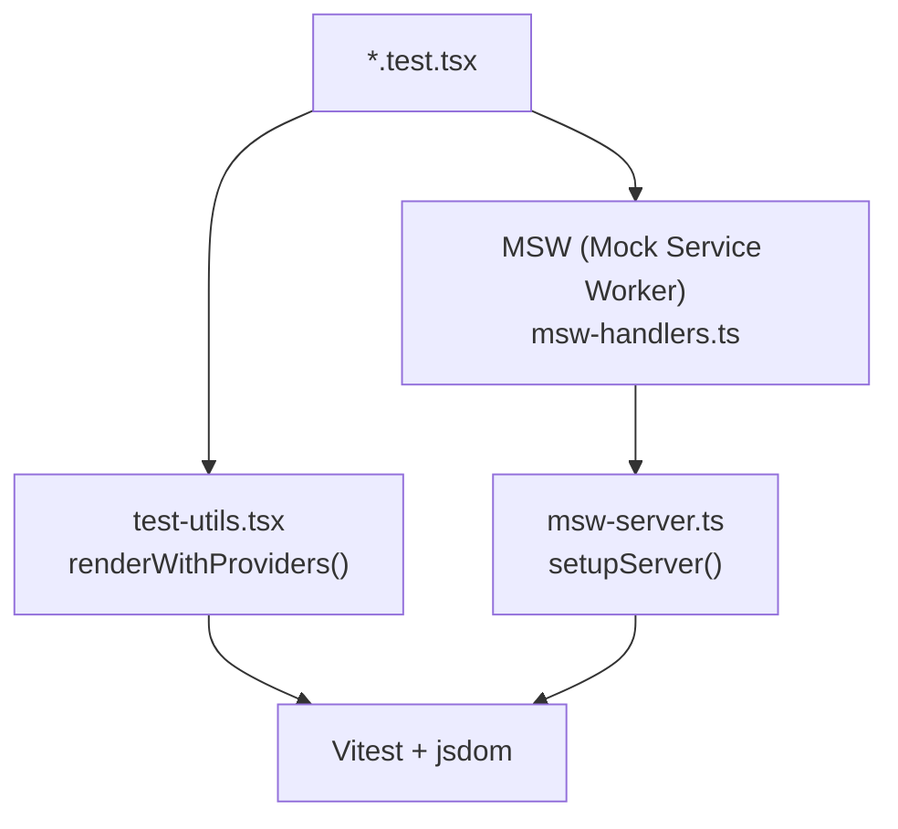

# Architecture — Donations Frontend

A React SPA for managing church donations, expenses, and financial reports. Built with TypeScript, Vite, and a feature-driven module structure. It consumes the Donations API backend through a client generated from that API's OpenAPI spec.

---

## Key Design Decisions

Decisions as they stand in the code today. Each one links to its context,
the decision itself, and its trade-offs in
[Design Decisions in Detail](#design-decisions-in-detail).

| Decision                                                                                  | Summary                                                                                                     |
| ----------------------------------------------------------------------------------------- | ----------------------------------------------------------------------------------------------------------- |
| [Generated API client](#generated-api-client)                                             | The API's OpenAPI spec is the single source of truth. A contract change breaks `typecheck`, not production. |
| [Global HTTP hooks via ky](#global-http-hooks-via-ky)                                     | Session expiry (401) and forced password change (403) are handled once, for every request.                  |
| [Same-origin API proxy](#same-origin-api-proxy)                                           | nginx proxies `/api`, which allows a strict CSP and a `SameSite` session cookie with no CORS.               |
| [Server state only in React Query](#server-state-only-in-react-query)                     | No global client store. Caching, invalidation and request cancellation come from one library.               |
| [URL as state](#url-as-state)                                                             | Page, sort, report tab and selected donor live in the URL, so views survive refresh and can be shared.      |
| [Errors as ProblemDetail](#errors-as-problemdetail)                                       | Two shared helpers turn every API error into form field errors or one user message.                         |
| [Feature slices](#feature-slices)                                                         | Each domain owns its pages, form, schema, hooks and tests in one folder.                                    |
| [Lazy routes and two-level error boundaries](#lazy-routes-and-two-level-error-boundaries) | Each page is its own chunk, and a page crash keeps the app shell usable.                                    |

---

## Domain Model

Conceptual view of what the app manages. Each line is labelled with the field
that links the two sides. Reports (statement, summaries, balance) are read-only
aggregates over a date range. Field-level types are not
documented here: they are generated from the Donations API's OpenAPI spec (see
[Working with generated types](#working-with-generated-types)).


```mermaid
erDiagram
    DONOR |o--o{ DONATION : "donorId"
    USER }o--|{ ROLE : "roles"
    DONOR ||--o{ DONOR_STATEMENT : "donorId"
    DONATION }o--o{ DONATION_SUMMARY : "donationType"
    EXPENSE }o--o{ EXPENSE_SUMMARY : "category"
    DONATION }o--o{ BALANCE : "donationDate"
    EXPENSE }o--o{ BALANCE : "expenseDate"
```

- A donation may have no donor (anonymous offering).
- Roles gate what each user sees: operators and treasurers record data,
  treasurers and pastors read reports, admins manage users.

---

## Tech Stack

| Concern       | Library                                                   |
| ------------- | --------------------------------------------------------- |
| UI Library    | React (with React Compiler)                               |
| Language      | TypeScript (strict)                                       |
| Build Tool    | Vite                                                      |
| Routing       | React Router                                              |
| Server State  | TanStack React Query                                      |
| Forms         | React Hook Form                                           |
| Schema valid  | Zod                                                       |
| API Client    | `@jorgetroya80/donations-api-client` (generated, OpenAPI) |
| HTTP Adapter  | ky (injected as the generated client's `fetch`)           |
| Styling       | Tailwind CSS                                              |
| UI Primitives | Base UI                                                   |
| Charts        | Recharts                                                  |
| Icons         | Lucide React                                              |
| i18n          | react-i18next                                             |
| Dates         | Day.js                                                    |
| Linting       | Biome                                                     |
| Testing       | Vitest                                                    |
|               | React Testing Library                                     |
| API Mocking   | MSW                                                       |

---

## Project Structure

```
src/
├── App.tsx                  # Root: provider tree (QueryClient · Theme · Auth · Tooltip · Toast · Router)
├── app-routes.tsx           # Route declarations + lazy page imports
├── main.tsx                 # Entry point
│
├── features/                # Feature modules (self-contained slices)
│   ├── auth/                # Login, protected routes, role guards, auth context
│   ├── dashboard/           # Home page with role-conditional stats and charts
│   ├── donations/           # CRUD + duplicate detection
│   ├── donors/              # CRUD for donor master data
│   ├── expenses/            # CRUD for expense records
│   ├── reports/             # Donation/expense summaries, donor statements
│   ├── settings/            # Change password
│   ├── theme/               # Dark/light mode context
│   └── users/               # Admin user management
│
├── layouts/
│   ├── app-layout.tsx       # Sidebar + Header + <Outlet> (with ErrorBoundary + Suspense)
│   ├── header.tsx           # Top navigation bar
│   ├── sidebar.tsx          # Left nav with role-filtered links
│   └── use-page-title.ts    # Dynamic page title for the header
│
├── components/
│   ├── ui/                  # Primitives (Button, Input, Table, Dialog, Tabs, Toast, Chart…)
│   ├── date-range-picker.tsx
│   ├── empty-state.tsx
│   ├── error-boundary.tsx   # Catches render errors, shows fallback + reload
│   ├── page-header.tsx      # Page title + actions row
│   ├── skeleton.tsx
│   └── sortable-th.tsx      # Table header wired to use-sort
│
├── lib/
│   ├── api.ts               # Generated API client (ky fetch adapter, 401/403 hooks)
│   ├── auth-events.ts       # FORCE_ROTATION_EVENT (forced password change)
│   ├── permissions.ts       # Role-check functions (RBAC)
│   ├── formatters.ts        # Currency, date helpers
│   ├── get-problem-message.ts     # RFC 9457 ProblemDetail → user message
│   ├── parse-api-field-errors.ts  # Maps API validation errors to form fields
│   ├── use-sort.ts          # Table sort in ?sort= (toggle, indicator, aria-sort)
│   ├── use-page-param.ts    # Pagination in ?page=
│   ├── use-debounced-value.ts
│   ├── i18n.ts              # i18next configuration (Spanish)
│   └── utils.ts             # cn() — Tailwind class merging
│
├── locales/
│   └── es.json              # Spanish translations
│
└── test/
    ├── setup.ts             # Vitest global setup
    ├── msw-server.ts        # MSW server instance
    ├── msw-handlers.ts      # API mock handlers
    ├── problem-detail.ts    # ProblemDetail fixtures for error tests
    └── test-utils.tsx       # render() wrapper with providers
```

---

## Feature Module Structure

CRUD features (donations, donors, expenses, users) follow the same file layout. Auth, dashboard, reports, settings and theme are shaped by their own needs.

```
src/features/<name>/
├── index.ts                  # Barrel export (donors, reports, users)
├── <name>-schema.ts          # Zod validation schema + inferred form type
├── use-<name>s.ts            # React Query hooks (useQuery + useMutation)
├── <name>s-page.tsx          # List page (table + filters + pagination)
├── <name>-create-page.tsx    # Create page (wraps form)
├── <name>-edit-page.tsx      # Edit page (loads entity, wraps form)
├── <name>-form.tsx           # Shared form component
└── *.test.tsx                # Vitest + RTL unit tests
```

Example — Donations:

| File                       | Responsibility                                                                            |
| -------------------------- | ----------------------------------------------------------------------------------------- |
| `donation-schema.ts`       | Zod schema for create/edit, inferred `CreateDonationFormData`                             |
| `use-donations.ts`         | `useDonations(params)`, `useDonation(id)`, `useCreateDonation()`, `useUpdateDonation(id)` |
| `donations-page.tsx`       | Paginated table with date-range filter and sort                                           |
| `donation-create-page.tsx` | Wraps form, handles duplicate-detection warning                                           |
| `donation-edit-page.tsx`   | Fetches existing donation, pre-fills form                                                 |
| `donation-form.tsx`        | Form: amount, date, type, payment method, donor, notes                                    |

---

## Application Layers


```mermaid
graph TD
    Browser["Browser"]

    subgraph React["React Application"]
        Providers["Provider Tree\n(QueryClient · Theme · Auth · Tooltip · Toast)"]
        Router["React Router\n(BrowserRouter)"]
        Guards["Route Guards\n(ProtectedRoute · RoleRoute)"]
        Layout["AppLayout\n(Sidebar + Header + Outlet)"]
        Pages["Feature Pages\n(Dashboard · Donations · Donors…)"]
        Hooks["React Query Hooks\n(useQuery · useMutation)"]
        APIClient["Generated API Client\n(ky fetch adapter) — /api/v1"]
    end

    Backend["Backend REST API\n(/api/v1)"]

    Browser --> Providers
    Providers --> Router
    Router --> Guards
    Guards --> Layout
    Layout --> Pages
    Pages --> Hooks
    Hooks --> APIClient
    APIClient -->|"HTTP (credentials: include)"| Backend
```

---

## Component Hierarchy


```mermaid
graph TD
    App["App.tsx"]
    QCP["QueryClientProvider"]
    TP["ThemeProvider"]
    AP["AuthProvider"]
    TTP["TooltipProvider"]
    TSP["ToastProvider"]
    BR["BrowserRouter"]
    PR["ProtectedRoute"]
    AL["AppLayout"]
    SB["Sidebar"]
    HD["Header"]
    OUT["&lt;Outlet&gt;"]

    Pages["Feature Pages\n(DashboardPage · DonationsPage\nDonorCreatePage · ReportsPage…)"]
    Forms["Feature Forms\n(DonationForm · DonorForm\nExpenseForm · UserForm)"]
    Tables["Feature Tables\n(with pagination + filters)"]
    UIComp["UI Components\n(Button · Input · Card · Table\nDialog · Select · Badge…)"]

    App --> QCP --> TP --> AP --> TTP --> TSP --> BR
    BR --> PR --> AL
    AL --> SB
    AL --> HD
    AL --> OUT
    OUT --> Pages
    Pages --> Forms
    Pages --> Tables
    Forms --> UIComp
    Tables --> UIComp
```

---

## Routing & Access Control

All page components are lazy-loaded (`React.lazy`) so each feature ships as
its own chunk. `<Suspense>` (Skeleton fallback) and an `ErrorBoundary` wrap
the routes at two levels: globally in `App.tsx`, and around the `<Outlet>` in
`AppLayout` so a page crash leaves the sidebar and header usable.

`ProtectedRoute` sends unauthenticated users to `/login`. While the user has
`mustChangePassword`, it redirects every route to `/settings/password`.
`RoleRoute` redirects to `/` when its permission check fails.


```mermaid
graph TD
    Root["/  (BrowserRouter)"]
    Login["/login  ·  LoginPage\n🔓 public"]
    PR["ProtectedRoute\n(checks AuthContext;\nmustChangePassword → /settings/password)"]
    AL["AppLayout"]

    D["/  ·  DashboardPage"]
    SP["/settings/password  ·  ChangePasswordPage"]

    RR1["RoleRoute\ncanRecordData()\nOPERATOR or TREASURER"]
    Don["/donations  ·  DonationsPage"]
    DonNew["/donations/new  ·  DonationCreatePage"]
    DonEdit["/donations/:id/edit  ·  DonationEditPage"]
    Donor["/donors  ·  DonorsPage"]
    DonorNew["/donors/new  ·  DonorCreatePage"]
    DonorEdit["/donors/:id/edit  ·  DonorEditPage"]
    Exp["/expenses  ·  ExpensesPage"]
    ExpNew["/expenses/new  ·  ExpenseCreatePage"]
    ExpEdit["/expenses/:id/edit  ·  ExpenseEditPage"]

    RR2["RoleRoute\ncanViewReports()\nTREASURER or PASTOR"]
    Rep["/reports  ·  ReportsPage"]

    RR3["RoleRoute\ncanManageUsers()\nADMIN only"]
    Usr["/users  ·  UsersPage"]
    UsrNew["/users/new  ·  UserCreatePage"]
    UsrEdit["/users/:id/edit  ·  UserEditPage"]

    Catch["/* → redirect /"]

    Root --> Login
    Root --> PR --> AL
    AL --> D
    AL --> SP
    AL --> RR1
    RR1 --> Don
    RR1 --> DonNew
    RR1 --> DonEdit
    RR1 --> Donor
    RR1 --> DonorNew
    RR1 --> DonorEdit
    RR1 --> Exp
    RR1 --> ExpNew
    RR1 --> ExpEdit
    AL --> RR2 --> Rep
    AL --> RR3
    RR3 --> Usr
    RR3 --> UsrNew
    RR3 --> UsrEdit
    Root --> Catch
```

---

## State Management

Four independent state layers, each with a distinct scope:

| Layer             | Tool                           | Persistence      | Scope            |
| ----------------- | ------------------------------ | ---------------- | ---------------- |
| Server state      | TanStack React Query           | Memory (cache)   | All API data     |
| Auth / Theme / UI | React Context + `localStorage` | localStorage     | Session lifetime |
| URL state         | `useSearchParams`              | URL              | Shareable link   |
| Form state        | React Hook Form                | Component memory | Form lifetime    |

### Server State (React Query)

- Each feature exposes query/mutation hooks (e.g., `useDonations`, `useCreateDonation`).
- `QueryClient` is configured globally with `retry: false`, `refetchOnWindowFocus: false` and `staleTime: 30_000`.
- Every query passes React Query's `signal` to the client, so leaving a page aborts its in-flight requests.
- Mutations invalidate the parent collection query on success, keeping the list in sync.

### Auth & Theme (Context + localStorage)

- `AuthProvider` (`src/features/auth/auth-context.tsx`) stores the current user and exposes `login` / `logout`.
- `ThemeProvider` (`src/features/theme/theme-context.tsx`) persists dark/light preference under key `theme`.
- The sidebar collapse state is persisted under key `sidebar_collapsed`.

### URL State

- `usePageParam()` keeps the list page in `?page=`, `useSort()` keeps the table sort in `?sort=`.
- The reports page keeps the active tab (and the selected donor on the statement tab) in search params.
- Refresh, back/forward and shared links restore the same view.

### Form State (React Hook Form)

- Each form defines a Zod schema in `*-schema.ts`.
- `useForm` is initialized with `zodResolver(schema)`.
- On submit: Zod validates locally, then the mutation fires. If the backend returns field-level errors, `parseApiFieldErrors()` maps them back to form fields.

---

## Authentication Flow

The session lives in an HTTP cookie (`credentials: 'include'`). `localStorage`
only keeps the username and roles, so the UI can render; the API remains
the authority on every request.


```mermaid
sequenceDiagram
    actor User
    participant LoginPage
    participant AuthContext
    participant localStorage
    participant API as Backend /api/v1

    User->>LoginPage: Enter credentials
    LoginPage->>API: POST /login { username, password }
    alt success
        API-->>LoginPage: user (username, roles, mustChangePassword)
        LoginPage->>AuthContext: login(user)
        AuthContext->>localStorage: set auth_user
        alt mustChangePassword
            LoginPage->>User: redirect to /settings/password
        else
            LoginPage->>User: redirect to /
        end
    else invalid credentials
        API-->>LoginPage: 401 / 400
        LoginPage->>User: show error (lockout hint after 5 failures)
    end

    note over AuthContext,API: Any later 401 (session expired)
    API-->>AuthContext: 401 (ky afterResponse hook)
    AuthContext->>localStorage: remove auth_user
    AuthContext->>User: redirect to /login

    note over AuthContext,API: Any later 403 PASSWORD_CHANGE_REQUIRED
    API-->>AuthContext: 403 (ky hook → FORCE_ROTATION_EVENT)
    AuthContext->>User: redirect to /settings/password
```

---

## Data Flow: Create Entity

Applies to donations, donors, expenses, and users. Donations add one step:
when the API flags a likely duplicate, the page asks the user to confirm and
resends the request with `confirmDuplicate: true`.


```mermaid
sequenceDiagram
    actor User
    participant Form as Feature Form\n(React Hook Form + Zod)
    participant Mutation as useMutation\n(React Query)
    participant Client as Generated client
    participant API as Backend /api/v1
    participant Cache as Query Cache

    User->>Form: Fill fields and submit
    Form->>Form: Zod schema validation
    alt validation fails
        Form->>User: Show inline field errors
    else validation passes
        Form->>Mutation: mutateAsync(formData)
        Mutation->>Client: createEntity({ body, client, throwOnError: true })
        Client->>API: POST /entity
        alt success (201)
            API-->>Mutation: EntityResponse
            Mutation->>Cache: invalidateQueries(['entity'])
            Mutation->>User: success toast + navigate back to list
        else API field errors (400)
            API-->>Mutation: ProblemDetail { fields: {...} }
            Mutation->>Form: parseApiFieldErrors() → setError()
            Form->>User: Show server-side field errors
        else other error
            API-->>Mutation: ProblemDetail
            Mutation->>Form: getProblemMessage()
            Form->>User: Show alert with message
        end
    end
```

---

## Data Flow: List with Filters & Pagination


```mermaid
sequenceDiagram
    actor User
    participant Page as Feature List Page
    participant State as URL params (page, sort)\n+ useState (date range)
    participant Query as useQuery\n(React Query)
    participant Client as Generated client
    participant API as Backend /api/v1

    Page->>Query: mount — useQuery(key, params)
    Query->>Client: listEntity({ query, client, throwOnError, signal })
    Client->>API: GET /entity?page=0&size=10&...
    API-->>Client: { content, page }
    Client-->>Query: parsed response
    Query-->>Page: { data, isLoading, isError }
    Page->>User: Render table + pagination

    User->>Page: Change filter / page / sort
    Page->>State: setSearchParams() / setState()
    State->>Query: key changes → auto-refetch
    Query->>Client: listEntity(...new params...)
    Client->>API: GET /entity?page=1&...
    API-->>Page: updated { content, page }
    Page->>User: Re-render table
```

---

## API Client

**File:** `src/lib/api.ts`

HTTP access goes through the generated client from the npm package
`@jorgetroya80/donations-api-client` (published from the backend's OpenAPI
spec, pulled from GitHub Packages). A ky instance is injected as the fetch
adapter so global response hooks still apply:

```
kyInstance (ky.create)
  credentials: 'include'      (session cookie forwarded on all requests)
  throwHttpErrors: false      (generated client handles status codes)
  afterResponse hook:
    if status === 401 && path !== /api/v1/login
      → localStorage.removeItem('auth_user')
      → window.location.href = '/login'
    if status === 403 && body.code === 'PASSWORD_CHANGE_REQUIRED'
      → flag stored user with mustChangePassword
      → dispatch FORCE_ROTATION_EVENT
      → redirect to /settings/password

client = createClient({ baseUrl: origin, fetch: kyInstance })
```

`pageableQuerySerializer()` (same file) flattens Spring `Pageable` params
(`page`, `size`, `sort`) plus optional `from`/`to`/`search` into flat query params,
because hey-api's default deepObject serializer can't handle arrays nested
inside objects.

Usage pattern in hooks:

```ts
import {
  listDonations,
  createDonation,
} from '@jorgetroya80/donations-api-client';
import { client, pageableQuerySerializer } from '@/lib/api';

// Read
const data = await listDonations({
  query: { from, to, pageable: { page, size, sort: [sort] } },
  client,
  throwOnError: true,
  signal,
  querySerializer: pageableQuerySerializer,
}).then(({ data }) => data);

// Write
const data = await createDonation({ body, client, throwOnError: true }).then(
  ({ data }) => data
);
```

### Working with generated types

- No API types are written by hand. Features import request/response types
  from the client package.
- List endpoints return `{ content, page }`, with pagination metadata nested
  under `page`.
- Every response field is optional in the generated types, so UI code
  defaults with `??` (for example `data.content ?? []`).
- Enumerations (donation type, payment method, expense category, role) are
  string-literal unions, not named enums. Zod schemas and translations list
  the same values.

---

## Testing Architecture


```mermaid
graph TD
    Test["*.test.tsx"]
    TU["test-utils.tsx\nrenderWithProviders()"]
    MSW["MSW (Mock Service Worker)\nmsw-handlers.ts"]
    Server["msw-server.ts\nsetupServer()"]
    Vitest["Vitest + jsdom"]

    Test --> TU
    TU --> Vitest
    Test --> MSW
    MSW --> Server
    Server --> Vitest
```

- Tests use `renderWithProviders()` from `test-utils.tsx`, which wraps components in QueryClient, Theme, Auth, Toast and a `MemoryRouter` (with an optional initial route).
- MSW intercepts `fetch` at the network layer, returning fixtures defined in `msw-handlers.ts`.
- Unhandled requests fail the test (`onUnhandledRequest: 'error'`). Handlers and `localStorage` reset after each test.
- Hooks run for real against MSW responses. Module mocks are the exception: a few edit-page tests mock `react-router`, and the dashboard test stubs its child widgets.

Run tests: `pnpm run test`

---

## Design Decisions in Detail

### Generated API client

#### Context

The API is a separate service. Before this decision the frontend kept
hand-written API types and built URL strings in every hook, so any backend
change had to be copied by hand and drift only showed up at runtime.

#### Decision

All server access goes through `@jorgetroya80/donations-api-client`, generated
from the Donations API's OpenAPI spec and published to GitHub Packages. Hooks
call typed functions (`listDonations`, `createDonation`, …) with
`throwOnError: true`. No API types are written in this repo.

#### Trade-offs

- **Gain:** a contract change fails `typecheck`; paths, query params and
  bodies are typed at the call site.
- **Cost:** installing dependencies needs a GitHub token with `read:packages`,
  locally, in CI and in Docker builds.
- **Cost:** every response field is optional in the generated types, so UI code
  needs `??` defaults.
- **Cost:** the generated query serializer cannot handle Spring's nested
  `Pageable`, so `pageableQuerySerializer()` flattens it by hand.

### Global HTTP hooks via ky

#### Context

Two responses need the same handling on every request: a 401 means the
session expired, and a 403 with `PASSWORD_CHANGE_REQUIRED` means the user must
rotate their password. ky, the HTTP client used before the generated client,
already handled them with `afterResponse` hooks.

#### Decision

A ky instance (`credentials: 'include'`, `throwHttpErrors: false`) is injected
as the generated client's `fetch`. Its hook clears the stored user and
redirects to `/login` on 401, and flags the user and redirects to
`/settings/password` on the 403.

#### Trade-offs

- **Gain:** auth side effects live in one place; feature hooks know nothing
  about them.
- **Cost:** one more dependency next to the generated client, and error
  behavior is split: ky never throws, the generated client throws through
  `throwOnError`.
- **Cost:** the redirects set `window.location.href`, a full page load that
  drops the React Query cache.

### Same-origin API proxy

#### Context

In production the SPA and the API run as separate services. The session
cookie is `SameSite=Lax; Secure`, and the API's production profile has CORS
disabled.

#### Decision

The nginx container that serves the SPA also proxies `/api/` to the API. The
upstream, host and port come from environment variables through the nginx
image's template entrypoint, so the same image runs in docker-compose and on
Render. In development the Vite dev server proxies `/api` the same way.

#### Trade-offs

- **Gain:** the browser only talks to its own origin, which allows the strict
  CSP `connect-src 'self'`, keeps the cookie working, and needs no CORS.
- **Cost:** the frontend must ship as a container, not as files on a static
  host or CDN.
- **Cost:** every API call takes an extra hop through nginx, and each
  environment must set the upstream variables, or nginx fails at start.

### Server state only in React Query

#### Context

Almost all state is API data. Client-only state is small: the session user,
the theme and the sidebar collapse flag.

#### Decision

Each feature exposes React Query hooks. Mutations invalidate their collection
key on success. Every query passes React Query's `signal`, so leaving a page
aborts its in-flight requests; mutations are never cancelled, to avoid partial
writes. Client-only state lives in two React Contexts backed by
`localStorage`. Global defaults: `retry: false`,
`refetchOnWindowFocus: false`, `staleTime: 30_000`.

#### Trade-offs

- **Gain:** no global store, no hand-written loading or error state, and
  request cancellation for free.
- **Cost:** invalidating by key prefix refetches the whole collection,
  including pages the user is not looking at.
- **Cost:** data can be up to 30 seconds old, and with no retry a transient
  failure (for example, the API waking from a cold start) shows an error
  right away.

### URL as state

#### Context

Page and sort used to be local component state, so a refresh, the back
button or a shared link lost the current view.

#### Decision

`usePageParam()` and `useSort()` keep page and sort in search params. The
reports page keeps its active tab and selected donor there too. Defaults are
left out of the URL. The page is 1-based in the URL and 0-based internally,
matching the API. Page and sort changes replace the history entry; tab
switches push one, so Back moves between tabs, not through pagination.
Invalid values fall back to defaults, and sort fields are checked against an
allowlist.

#### Trade-offs

- **Gain:** views can be bookmarked and shared, and the back button behaves as
  users expect.
- **Cost:** URL values are untrusted input, so every param needs parsing and
  validation.
- **Cost:** date-range filters stayed in local state, so a shared link restores
  page and sort but not the date range.

### Errors as ProblemDetail

#### Context

The API returns every 4xx and 5xx as RFC 9457 `application/problem+json`.
Validation errors add a `fields` map from field name to message.

#### Decision

Two helpers in `src/lib/` cover every case: `parseApiFieldErrors()` feeds
`fields` into React Hook Form's `setError()`, and `getProblemMessage()` returns
`detail`, then `title`, then a translated fallback. Features never parse error
bodies themselves.

#### Trade-offs

- **Gain:** errors look the same everywhere, and a change to the error format
  touches two files.
- **Cost:** `detail` and field messages are shown as the API wrote them, so
  their wording and language depend on the backend, not on the frontend's
  translations.
- **Cost:** login is the exception: it reads status codes directly, because a
  401 there means bad credentials, not an expired session.

### Feature slices

#### Context

The app covers nine domains, and most changes touch one of them: a new
field, a new filter, a new rule.

#### Decision

Each domain has one folder under `src/features/` with its pages, form, Zod
schema, query hooks and colocated tests. When another feature needs something
from it (for example, `DonorPicker`), the import goes through that feature's
`index.ts` barrel. Code shared by several features lives in `src/components/`
and `src/lib/`.

#### Trade-offs

- **Gain:** a change usually stays inside one folder, and its tests sit next
  to the code.
- **Cost:** the CRUD features repeat a similar list/create/edit/form shape
  instead of sharing a generic CRUD abstraction.

### Lazy routes and two-level error boundaries

#### Context

Charts and the date picker are heavy, and several pages are only reachable by
some roles, so most users never need their code.

#### Decision

Every page is loaded with `React.lazy`, and the chart and calendar widgets are
lazy inside their pages too. A `Suspense` + `ErrorBoundary` pair wraps the
routes in `App.tsx`, and another wraps the `<Outlet>` in `AppLayout`.

#### Trade-offs

- **Gain:** a smaller initial bundle, and a page crash leaves the sidebar and
  header usable.
- **Cost:** the first visit to each page waits for its chunk behind a
  skeleton.
- **Cost:** error boundaries only catch render errors; failed requests and
  event-handler errors are handled through React Query and component state.
